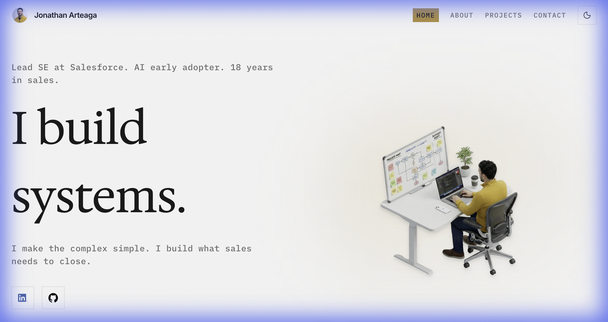

<div align="center">

# Jonathan Arteaga | Systems Architect

**A modern, editorial portfolio showcasing systems design, workflow automation, and 18 years of sales engineering expertise.**

[](https://ai.studio/apps/drive/1Y5bopPudkjxz2dSNS5etMdJKLE3PRG0v)
[](https://vitejs.dev/)
[](https://react.dev/)

</div>

---

## 📸 Preview

<div align="center">
  
</div>

---

## ✨ Features

- **Smooth Scroll Experience** — Powered by Lenis for buttery-smooth scrolling animations
- **Dark/Light Theme** — Elegant theme switching with system preference detection
- **Responsive Design** — Fluid typography and layouts that adapt to any screen size
- **Modern Animations** — Scroll-triggered reveals, particle backgrounds, and micro-interactions
- **Editorial Aesthetic** — High-end design inspired by premium editorial websites

---

## 🛠️ Tech Stack

| Technology | Purpose |
|------------|---------|
| **React 19** | UI framework |
| **TypeScript** | Type safety |
| **Vite** | Build tool & dev server |
| **Tailwind CSS** | Utility-first styling |
| **Lenis** | Smooth scrolling |
| **Lucide React** | Icon library |

---

## 🚀 Getting Started

### Prerequisites

- [Node.js](https://nodejs.org/) (v18 or higher recommended)
- npm or yarn

### Installation

1. **Clone the repository**
   ```bash
   git clone https://github.com/jonathan-arteaga/systems-architect.git
   cd systems-architect
   ```

2. **Install dependencies**
   ```bash
   npm install
   ```

3. **Set up environment variables**
   
   Create a `.env.local` file and add your Gemini API key:
   ```env
   GEMINI_API_KEY=your_api_key_here
   ```

4. **Start the development server**
   ```bash
   npm run dev
   ```

5. **Open your browser**
   
   Navigate to `http://localhost:3000`

---

## 📁 Project Structure

```
├── components/          # React components
│   ├── Hero.tsx         # Landing section with particle animation
│   ├── BentoGrid.tsx    # About & journey grid layout
│   ├── Artifacts.tsx    # Projects showcase
│   ├── Testimonials.tsx # Social proof section
│   ├── Interests.tsx    # Personal interests
│   └── Footer.tsx       # Contact & footer
├── contexts/            # React context providers
├── hooks/               # Custom React hooks
├── public/              # Static assets
├── App.tsx              # Main application component
└── index.html           # Entry point with Tailwind config
```

---

## 📜 License

This project is open source and available under the [MIT License](LICENSE).

---

<div align="center">

**Built with ❤️ by Jonathan Arteaga**

[LinkedIn](https://linkedin.com) · [GitHub](https://github.com)

</div>
